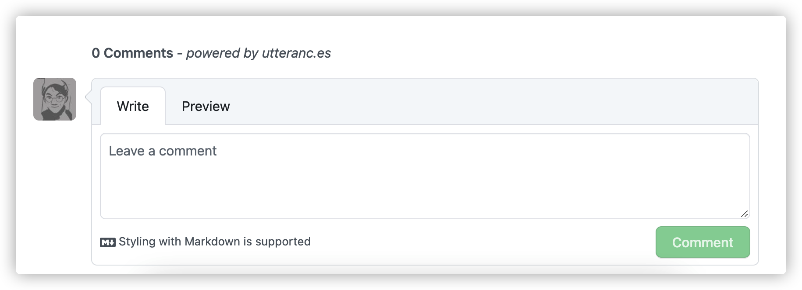

- 新版hugo academic（wowchemy 5.0+构建）与之前的布局有很大不同，theme/layouts.partial 没了，网络上能找到的方法都不能用（wowchem官方扩展的文档也没更新...）

- 内置的comments provider就两个 commento与disqus，不是被墙就是广告太多，影响观感

- 轻量级留言板 -- utteranc.es，利用github issue特性构建留言板，效果不错

    

- 上js...
  
    ```javascript
    var r = /\/post\/[a-zA-Z]+/.test(window.location.pathname)
    if (r) {
        (function(){
            var utterances = document.createElement('script');
            utterances.type = 'text/javascript';
            utterances.async = true;
            utterances.setAttribute('issue-term','pathname')
            utterances.setAttribute('theme','github-light')
            utterances.setAttribute('repo','dongdongdoge/utterances')
            utterances.crossorigin = 'anonymous';
            utterances.src = 'https://utteranc.es/client.js';
            document.body.appendChild(utterances);
        })();
    }
    ```

---
<p style="color:red;text-align:center">(转载请注明出处)</p>


