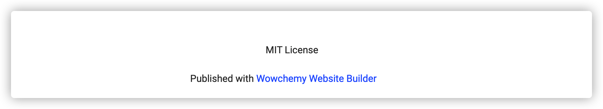
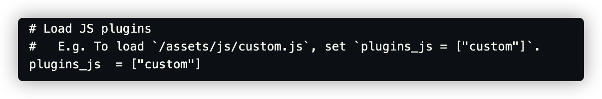

- 免费版本会有以下字样，最不能忍的是因此导致的scrollbar

- 在付费版本feature并没有很香的情况下，查文档得知`/config/_default/params.toml`中可以加载用户自定义js

- 简单利用DOM知识消除该元素，代码如下
  
    ```javascript
    document.ready = function (callback) {
        ///兼容FF,Google
        if (document.addEventListener) {
            document.addEventListener('DOMContentLoaded', function () {
                document.removeEventListener('DOMContentLoaded', arguments.callee, false);
                callback();
            }, false)
        }
        //兼容IE
        else if (document.attachEvent) {
            document.attachEvent('onreadystatechange', function () {
                  if (document.readyState == "complete") {
                            document.detachEvent("onreadystatechange", arguments.callee);
                            callback();
                  }
            })
        }
        else if (document.lastChild == document.body) {
            callback();
        }
    }

    document.ready(function(){
        var x = document.querySelector("div.container footer")
        y = x.parentElement
        y.remove()
    })
    ```
- 在有更多需求的情况下，请支持付费版<del>，原则上讲，所有feature都可以customize来实现</del>
---
<p style="color:red;text-align:center">(转载请注明出处)</p>


